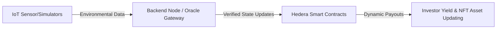

# Ecobond

A fullstack green bond investment platform that tokenizes environmental projects and enables USDC-backed investments through a sophisticated blockchain ecosystem. EcoBond combines smart contracts and backend IoT data simulators to create a transparent, measurable impact investment system.

*Built for the Hello Future Apex Hackathon (Sustainability Track)*

---

## 1. Project Overview
**Ecobond** is a comprehensive green bond funding protocol prioritizing transparency, verifiable impact, and automated yield distribution. We tokenize real world environmental initiatives and enable direct USDC investments. By combining EVM-compatible smart contracts with backend IoT data simulators acting as oracles, Ecobond creates a uniquely measurable and programmatic impact financing system. In a landscape plagued by greenwashing, Ecobond roots financial execution strictly in verifiable ecological reality.

**Who benefits?**
- **Environmental Collectives & Local Communities:** Gain direct access to global capital ecosystems without relying on centralized banks or highly extractive middlemen. This drastically lowers the barrier to entry for funding vital, community-level conservation projects.
- **Retail & Institutional Investors:** Access tokenized, yield-bearing green bonds with transparent, live on-chain metrics, effectively democratizing access to premium sustainability investments.
- **Global Carbon Markets:** Benefit from high integrity, automated MRV (Measurement, Reporting, and Verification) data directly from the source, providing an antidote to the low-quality, opaque credits flooding today's markets.

---

## 2. The Problem
Current environmental finance and legacy carbon markets are profoundly broken. Despite trillions of dollars pledged to climate action, capital deployment remains sluggish. Specifically, the ecosystem suffers from:

- **Opaque Reporting & Greenwashing:** Investors are forced to trust self-reported, heavily delayed, easily manipulated PDF reports regarding a project’s actual ecological impact.
- **High Friction & Rent-Seeking:** Intermediaries, brokers, and auditing agencies typically devour up to 50% of the funds intended for essential planetary restoration.
- **Double Counting:** Inadequate centralized registries mean the same carbon credits are frequently sold and retired multiple times, eroding all market trust.
- **Illiquidity & Inaccessibility:** Traditional green bonds are locked behind massive institutional walls with high minimum investment thresholds, keeping retail investors entirely out of the equation.

Ecobond fills this critical gap by turning abstract environmental promises into continuously monitored, programmatic smart contract executions—ensuring capital only flows when real-world impact is proven.

---

## 3. How It Works
Ecobond’s core architecture is built for end-to-end verifiability and frictionless capital deployment:

1. **Project Ingestion & NFT Issuance:** An environmental project (e.g., a regional reforestation effort, a localized solar farm) is onboarded onto the platform and minted as a unique NFT. This NFT acts as the "root bond," representing the entirety of the project's data and funding parameters.
2. **USDC Investment Flow:** Investors fund the project seamlessly using USDC. The Ecobond smart contract acts as an immutable escrow and distribution layer, ensuring funds are strictly allocated to the project's developers based on achieved milestones.
3. **IoT MRV Simulation Engine:** Our robust backend node acts as an oracle, feeding continuous, simulated IoT data (such as soil moisture levels, tree canopy density, or CO2 capture rates) directly into the Hedera smart contracts.
4. **Dynamic Yield & Payouts:** Capital distribution is explicitly tied to reality. If the environmental data achieves predefined thresholds (e.g., passing rigorous *creditQuality* and *greenImpact* scores), yield and funding are automatically unlocked and distributed. If the data fails verifications, payouts are securely halted.

*System Flow:*

---

## 4. Why Hedera?
We engineered Ecobond on Hedera not merely for its performance, but because its fundamental architectural primitives perfectly map to the requirements of planetary-scale, institutional-grade climate finance. 

- **Carbon-Negative Network:** Hedera's absolute commitment to sustainability means our infrastructure aligns perfectly with our mission. We aren't burning a forest's worth of energy to process a transaction that saves a tree.
- **Hedera Guardian (MRV):** We leverage Hedera Guardian’s powerful policy workflow engine to create verifiable, auditable MRV pipelines. Every ecological claim is securely rooted in an immutable policy state, preventing greenwashing at the architectural level.
- **Hedera Schedule Service (HSS):** We specifically utilize HSS to seamlessly schedule recurring yield distributions and automated token unlocks heavily dependent on oracle state changes. This reduces the need for manual multi-sig dependency and ensures highly secure, time-based transaction staging.
- **Hedera Consensus Service (HCS):** We use HCS to log the raw, high-frequency IoT data streams from our simulation backends. This creates an unalterable, decentralized, timestamped audit trail of the project's health, directly visible to any investor at any time.
- **Hedera Token Service (HTS):** HTS powers our low-cost, high-throughput token issuance. Fractionalizing project NFTs and issuing yield tokens happens natively at Layer-1 speeds, entirely bypassing clunky, expensive traditional smart contract overhead.
- **Sub-3-Second Finality & Predictable Low Fees:** Real-world assets demand real-world, real-time accounting. Hedera's predictable, fraction-of-a-cent fees mean we can update project states continuously without bankrupting the protocol—a requirement for high-fidelity IoT integration.
- **Enterprise-Grade Governance:** Institutional investors demand regulatory clarity and trust before deploying capital. The Hedera Global Governing Council (GBAC) provides the unparalleled stability required to onboard traditional, risk-averse green-bond capital.

---

## 5. Tech Stack
Ecobond's architecture spans smart contracts, modern web interfaces, and backend oracle infrastructure:

- **Smart Contracts (Hedera EVM):** Written in Solidity. Core logic resides in contracts like `ProjectMod.sol` and `InvestmentMod.sol`, managing bond issuance, state transitions, and USDC distribution.
- **Backend / IoT Oracle Node:** Node.js, Express, and Ethers.js. Acts as the data bridge, running IoT simulations and securely pushing state updates (impact metrics) onto the Hedera network via our oracle endpoints.
- **Frontend App:** Premium, responsive React / Vite web interface designed for seamless Web3 interaction, providing an intuitive dashboard for both project owners and investors.
- **Hedera SDKs & Services:** Deep integration with Hedera Hashgraph SDK leveraging HTS, HCS, HSS, and Hedera EVM capabilities.

---

## 6. Demo & Live Links

- **Video Demo Walkthrough:** 
- **Smart Contract 1 (ProjectMod):** [0.0.8324622-azcyc](https://hashscan.io/testnet/contract/0.0.8324622)
- **Smart Contract 2 (InvestmentMod):** [0.0.8324627-atpkj](https://hashscan.io/testnet/contract/0.0.8324627)
- **Presentation Deck:**

---

## 7. The Team
We are a dedicated team of Web3 engineers and sustainability advocates passionate about fixing real-world environmental tokenomics and shipping production-ready infrastructure.
- **[David Dada](https://github.com/dadadave80)**
- **[Abel Osaretin](https://github.com/AbelOsaretin)**
- **[Victory](https://github.com/pv-dsgn)**
- **[Kingsley](https://github.com/Kingscliq)**

---

## 8. Roadmap: Post-Hackathon
We view Ecobond as a standalone protocol destined for mainnet, not just a hackathon proof of concept. Our upcoming milestones include:

1. **Physical Hardware Integration:** Replace backend software simulators with live api integrations to physical IoT devices (e.g., Libelium sensors, satellite imagery APIs) to demonstrate absolute real world dMRV.
2. **Guardian Policy Mainnet Expansion:** Fully register our custom carbon methodology into the open-source Hedera Guardian registry to issue certified, compliant carbon credits matching Verra or Gold Standard frameworks.
3. **Decentralized Oracle Network (DON):** Transition from a single backend oracle to a decentralized oracle node operator model (such as Chainlink CCIP on Hedera) to guarantee fully trustless sensor data ingestion.
4. **Secondary Market & Liquidity Pools:** Launch native DEX liquidity pools (using SaucerSwap) for the tokenized green bonds, enabling immediate exit liquidity for retail investors.
5. **Institutional Pilot Onboarding:** Run a closed-beta pilot with a real-world community cooperative (e.g., a local agroforestry initiative in LATAM) to successfully tokenize and fully fund a $50k+ sustainable green bond on mainnet.
